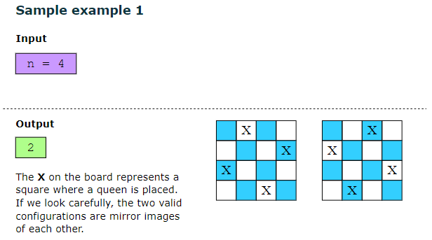

# N-queen problem

backtracking algorithm to solve the n−queens problem is very similar to a depth-first search of a tree.

There are two conditions that cause us to backtrack, but for two different purposes:

1- When we find that we cannot place the current queen in a particular row, we have to backtrack and alter the position of the queen whose position was decided before the current one. Next, we move forward again to find a safe position for the current queen.

2- Once we find a valid solution, we still have to identify all the other valid solutions. So, we backtrack by removing the last queen placed on the board and resuming our search for solutions from that point. In order to be sure to find all possible solutions, we’ll need to backtrack, row by row, all the way back to the first queen placed on the board, changing its position and then looking for alternative solutions.

# Word Search
