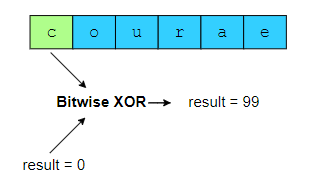
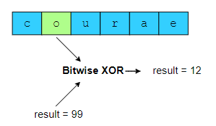
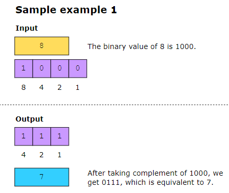
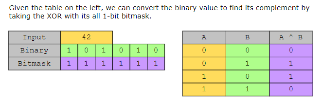
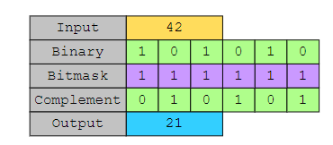
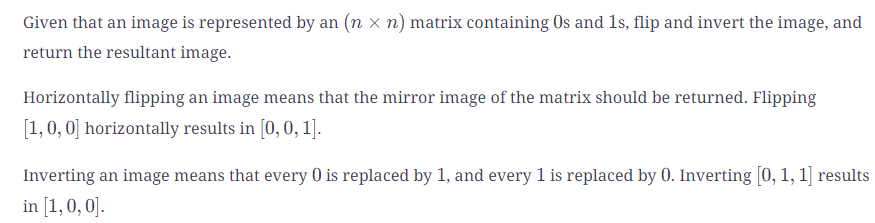
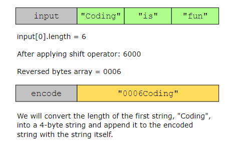

## Find the Difference #################
Given two strings, str1 and str2, find the index of the extra character that is present in only one of the strings.

## Complement of Base 10 Number ##########
For any 𝑛 positive number in base 10, return the complement of its binary representation as an integer in base 10.

to do binary complement: xor binary number with an array of ones the same size as input array. 

## Flipping an Image #####################

## Single Number #########################
Given an array of integers, where every element appears twice except for one, find the element that occurs only once.
## Two Single Numbers #####################
Given a non-empty array arr, in which exactly two elements appear once, and all the other elements appear twice, return the two elements that appeared only once.
** when we have xor of two number and then we find one of them we can find the second one by XORing with the XOR of two number.

## Encode and Decode Strings ##############
Create a method, encode, that converts an array of strings into a single string and then sends it over the network. Create another method, decode, that takes the encoded string and converts it back into the original array of strings.

## Reverse Bits #############################
Given an unsigned 32-bit integer n, we need to calculate a 32-bit unsigned integer with reversed bits. When we say “reverse” we don’t mean flipping the 
0s to 1s and vice versa, but simply reversing the order in which they appear, i.e., from left-to-right to right-to-left.
