## snapshot array ###################
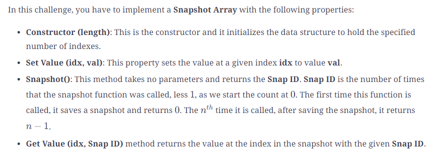
Suppose that we have three nodes whose values we wish to track in the snapshot array. Initially, the value of all the nodes will be 0. After calling the Set Value (1, 4) function, the value of node 1 will change to 4. If we take a snapshot at this point, the current values of all the nodes will be saved with Snap ID 
0 . Now, if we call Set Value (1, 7), the current value for node 1 will change to 7. Now, if we call the Get Value (1, 0) function, we will get the value of node 1 from snapshot 0, that is, 4.

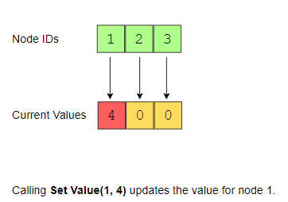
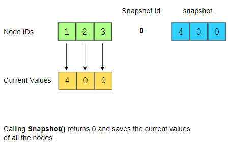
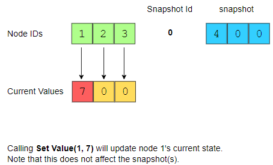
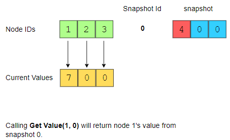
self.array1 {0: {0: 5}}
self.snapped {0: {0: 5}, 1: {0: 5}}
self.array1 {0: {0: 5}, 1: {0: 1}}
self.snapped {0: {0: 5}, 1: {0: 1}, 2: {0: 1}}
self.array1 {0: {0: 5}, 1: {0: 1}, 2: {0: 1, 2: 3}}
self.snapped {0: {0: 5}, 1: {0: 1}, 2: {0: 1, 2: 3}, 3: {0: 1, 2: 3}}
self.array1 {0: {0: 5}, 1: {0: 1}, 2: {0: 1, 2: 3}, 3: {0: 1, 2: 3, 1: 10}}
self.snapped {0: {0: 5}, 1: {0: 1}, 2: {0: 1, 2: 3}, 3: {0: 1, 2: 3, 1: 10}, 4: {0: 1, 2: 3, 1: 10}}

## Time-Based Key-Value Store #################
Implement a data structure that can store multiple values of the same key at different timestamps and retrieve the key’s value at a certain timestamp.

## Implement LRU Cache ########################
cache capacity is limited the idea here is when the cache gets full, the oldest data from cache will be removed and new data(key,value) will be added.
solution:
we have two operation:
Set and Get

doubly linkedlist => to arrange nodes by the time they were last accessed -> add the new element at the head of the linked list and remove the old one from tail.
hash map -> we can access the hash map lookup table in o(1) but hashmap doesn't have concept of recency so we use linkedlist to keep track of data time order( tail element from doubly linked list is oldest data) and hashmap to find that old data and remove it.

Note that the doubly linked list is used to keep track of the most recently accessed elements. The element at the head of the doubly linked list is the most recently accessed element. All newly inserted elements (in Set) go to the head of the list. Similarly, any element accessed (in the Get operation) goes to the head of the list.
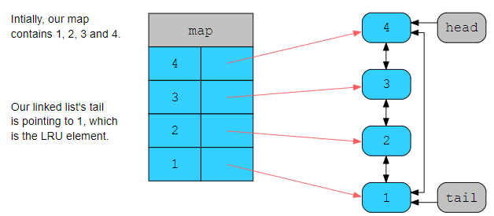
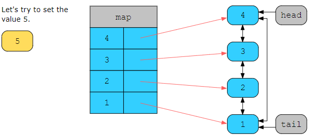
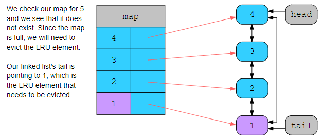
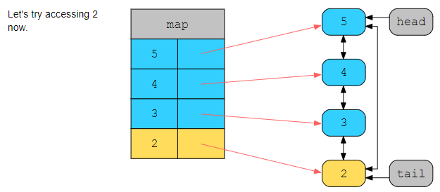
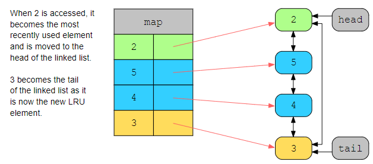

## Insert Delete GetRandom ####################
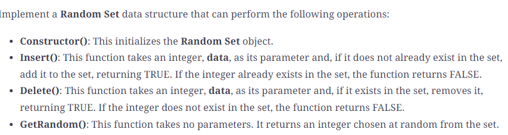
solution:
we need two data structures:
* Arrays support constant time lookups, but deletion takes O(n).
* Hash map supports constant time deletion. Here key will be new element and value will be its index in the array. 
So, we’ll use arrays and hash maps to design our custom data structure.

## min stack ###################################
Design a custom stack class, Min Stack, allowing us to push, pop, and retrieve the minimum value in constant time. Implement the following methods for Min Stack:

Constructor: This initializes the Min Stack object.

Pop(): This removes and returns from the stack the value that was most recently pushed onto it.

Push(): This pushes the provided value onto the stack.

Min Number(): This returns the minimum value in the stack in O(1) time.

## LFU Cache #####################################
Implement the LFUCache class. Here is how it should be implemented:

LFUCache(capacity): This function initializes the object with the capacity of the data structure.

Get(key): This function gets the value of the key if it exists in the cache. Otherwise, it returns -1.

Put(key, value): This function updates the value of the key if present, or inserts the key if it’s not present. When the cache reaches its capacity, it should invalidate and remove the least frequently used key before inserting a new item. For this problem, when there’s a tie, that is, two or more keys have the same frequency, the least recently used key is invalidated.

