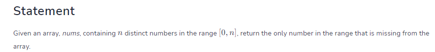
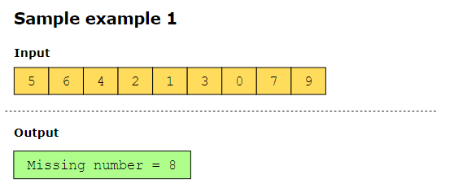
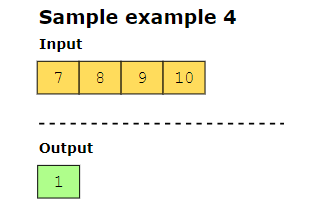
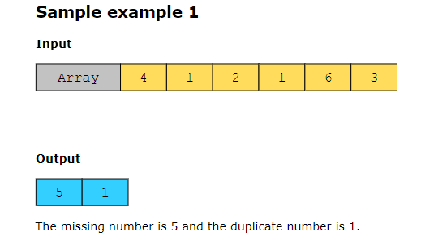
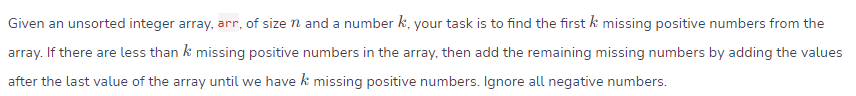
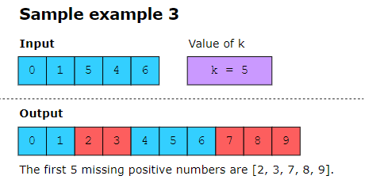

## missing number######################

## First Missing Positive##############
The smallest missing positive isn’t the first positive number that’s missing in the range of elements in the input, but the first positive number that’s missing if we start from 1.

## Corrupt pair #######################

** if we have more than one problematic element we don't compare nums[i] != (i+1) any more with compare it with nums[i] != nums[nums[i]-1]

## missing positive####################

