# Knapsack
You are given n items whose weights and values are known, as well as a knapsack to carry these items. The knapsack cannot carry more than a certain maximum weight, known as its capacity. You need to maximize the total value of the items in your knapsack, while ensuring that the sum of the weights of the selected items does not exceed the capacity of the knapsack.

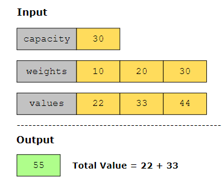

# coin change#################
Given an integer total that represents the target amount of money and a list of integers coins that represents different coin denominations, find the minimum number of coins required to make up the total amount. If it’s impossible to achieve the target amount using the given coins, return -1. If the target amount is 0, return 0.

# Tribonacci##################

# Partition Equal Subset Sum
Given a non-empty array of positive integers, determine if the array can be divided into two subsets so that the sum of both subsets is equal.
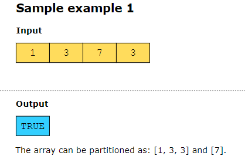

naive recursive approach

better approach

# bit counts######################
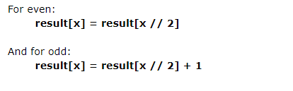

# 01 Matrix##########################
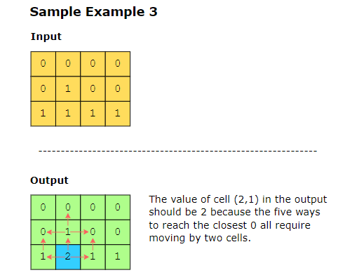

start from top-left and just check the cell above and on the left:
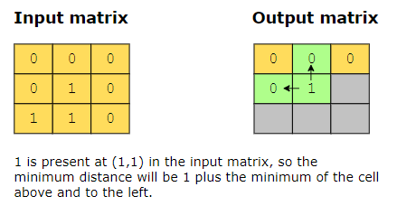
then start from bottom-right and check the right and bottom cell only:
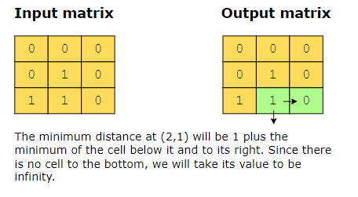
compare the distance with the distance from first step and pick the minimum. 

# House Robber II ##############################
A professional robber plans to rob some houses along a street. These houses are arranged in a circle, which means that the first and the last house are neighbors. The robber cannot rob adjacent houses because they have security alarms installed.

Following the constraints mentioned above and given an integer array money representing the amount of money in each house, return the maximum amount the robber can steal without alerting the police.

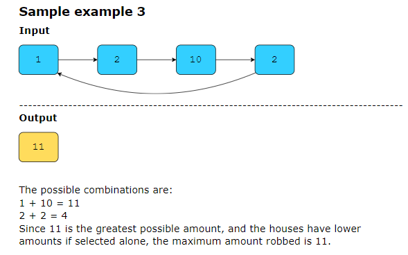
 
 bottom-up solution:
 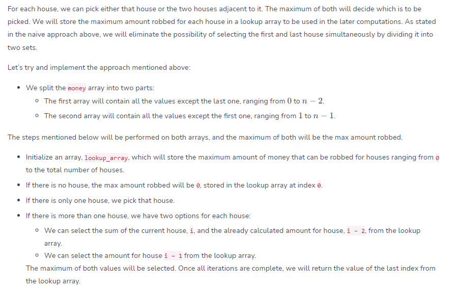
 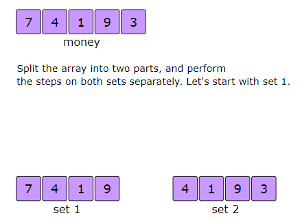
 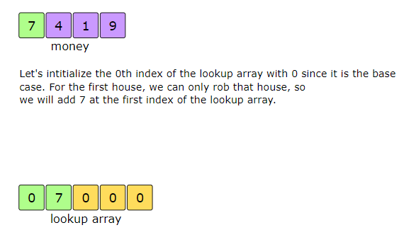
 For two or more houses, we can either pick the sum of the current house i and maximum value till house i-2 (current+i-1 are not adjacent), which is stored in the lookup array, or the maximum value till house i-1 (one house before the current house which exclude the current house), which is also stored in the lookup array. We will pick the greater value from the two . basically we decide for every house to include it or exclude it.
 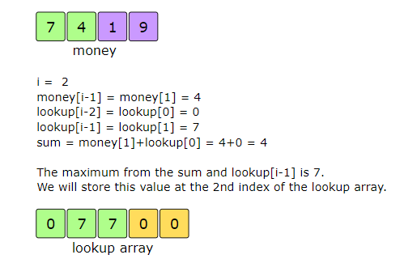
 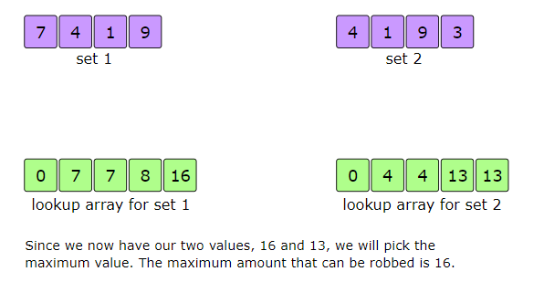

 # Maximum Product Subarray #######################
 Given an integer array, nums, find a subarray that has the largest product, and return the product.
 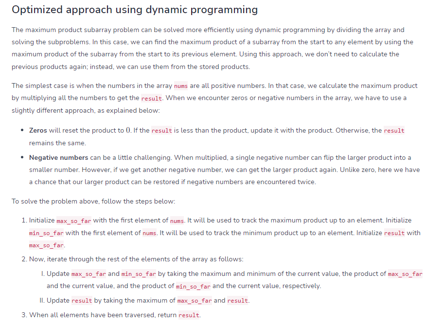

 we keep minimum here due to Multiplying a negative number by another negative number results in a positive product. Therefore, if min_so_far is negative and we encounter another negative number, the resulting product could become a new maximum.

# Combination Sum ##################################
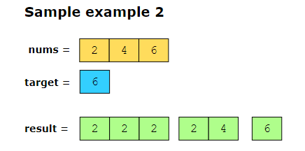

# word break ########################################
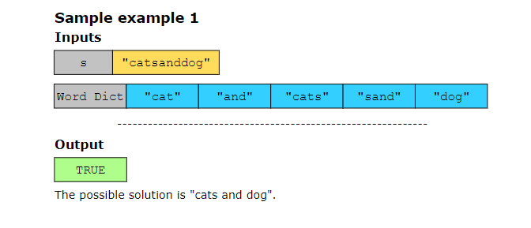

# Palindromic Substrings ############################
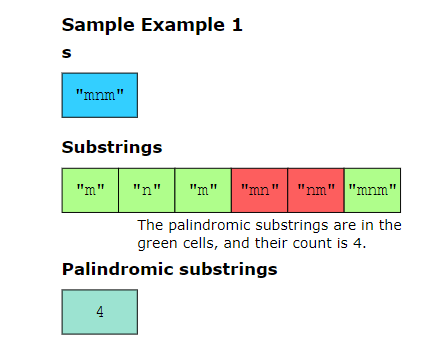

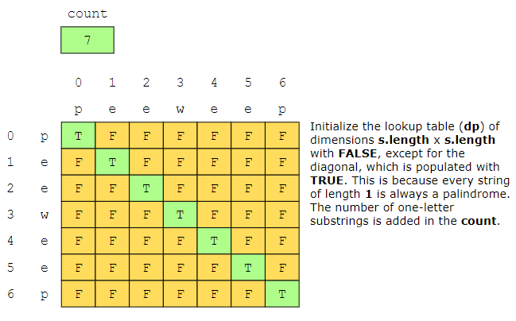

# Longest Common Subsequence ##########################
Suppose you are given two strings. You need to find the length of the longest common subsequence between these two strings.

A subsequence is a string formed by removing some characters from the original string while maintaining the relative position of the remaining characters. For example, “abd” is a subsequence of “abcd”, where the removed character is “c”.

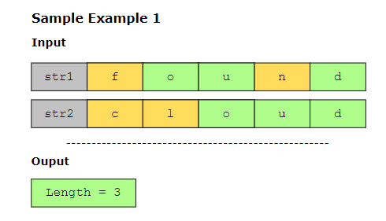
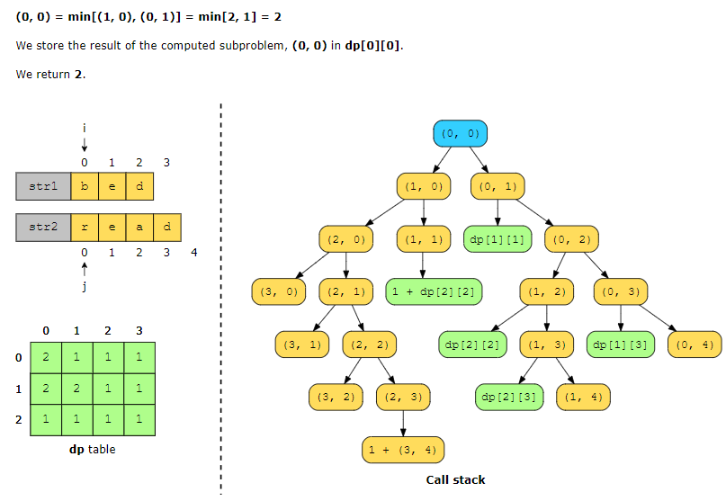

