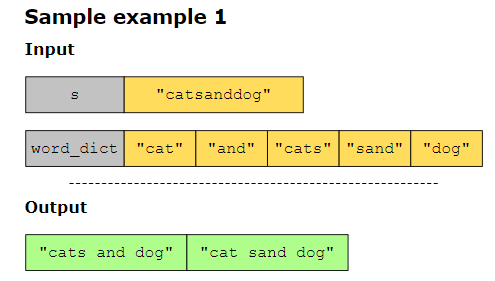
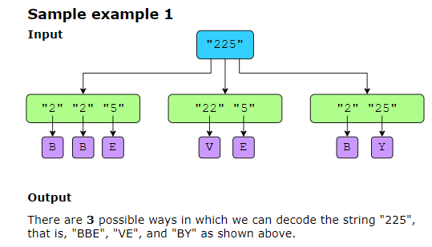
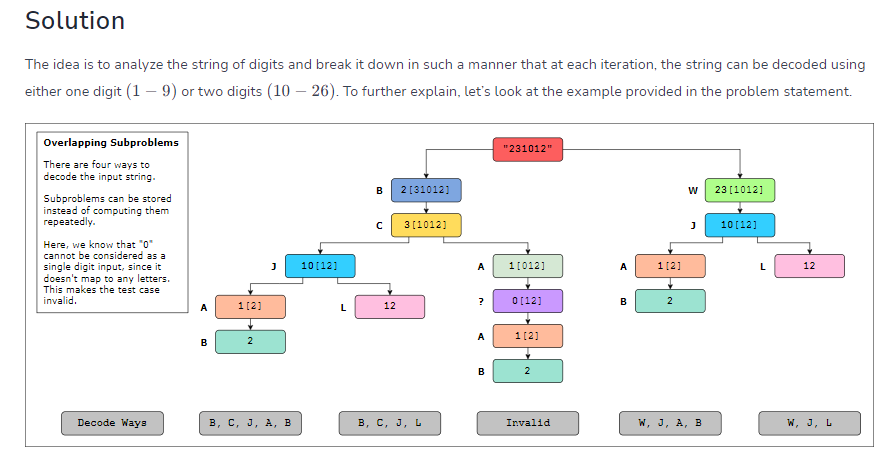
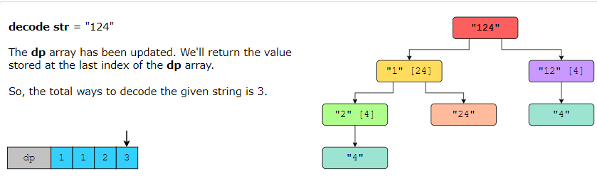
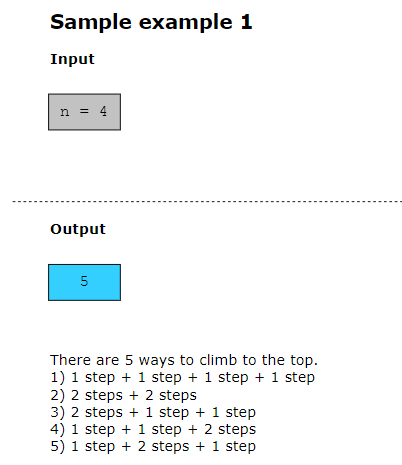

# word break 2 #######################
You are given a string, s, and an array of strings, word_dict, representing a dictionary. Your task is to add spaces to s to break it up into a sequence of valid words from word_dict. We are required to return an array of all possible sequences of words (sentences). The order in which the sentences are listed is not significant.

# Decode way###########################
Given a string that has only positive digits, your task is to decode the string and determine the number of possible ways to decode it.
Consider the input string as an encoded message, where each digit in the string represents an alphabet from A to Z. For reference, let’s look at the mapping below:

# Climb Strairs############################
You are climbing a staircase. It takes n steps to reach the top. Each time, you can either climb 1 or 2 steps. In how many distinct ways can you climb to the top?

