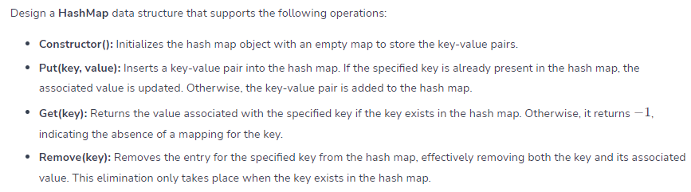
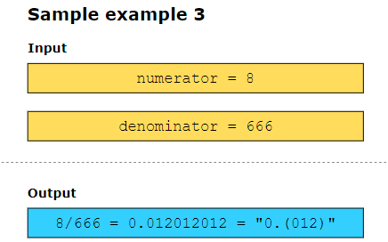
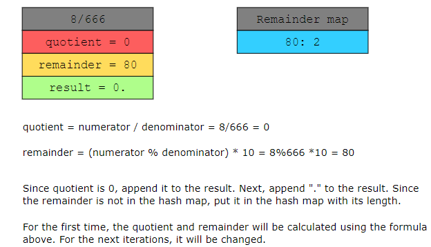
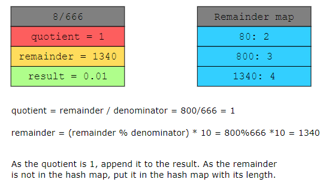
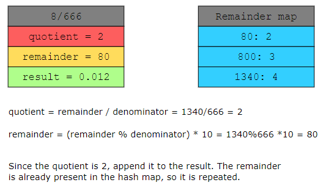
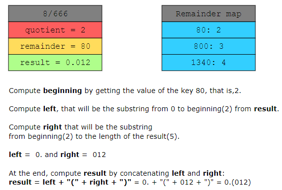
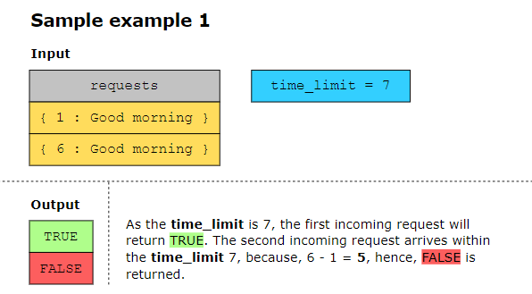
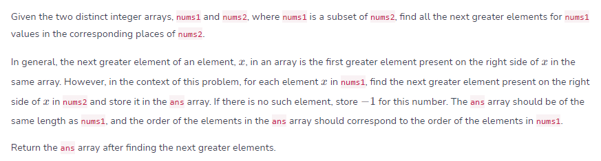
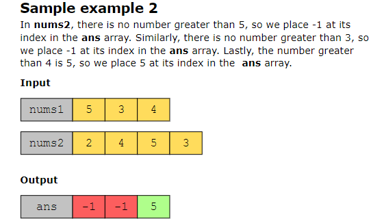
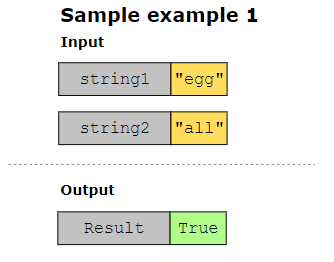

## Design HashMap ##############

## Fraction to Recurring Decimal ##############
Given the two integer values of a fraction, numerator and denominator, implement a function that returns the fraction in string format. If the fractional part repeats, enclose the repeating part in parentheses.

## Logger Rate Limiter ##########################
For the given stream of message requests and their timestamps as input, you must implement a logger rate limiter system that decides whether the current message request is displayed. The decision depends on whether the same message has already been displayed in the last 𝑆 seconds. If yes, then the decision is FALSE, as this message is considered a duplicate. Otherwise, the decision is TRUE.

## Next Greater Element #########################

The key point is that for each element in nums1, we only consider the elements in nums2 that come after its position in nums2.

## Isomorphic Strings ###########################
Given two strings, check whether two strings are isomorphic to each other or not.  Two strings are isomorphic if a fixed mapping exists from the characters of one string to the characters of the other string. For example, if there are two instances of the character "a"  in the first string, both these instances should be converted to another character (which could also remain the same character if "a" is mapped to itself) in the second string. This converted character should remain the same in both positions of the second string since there is a fixed mapping from the character "a" in the first string to the converted character in the second string.
Note: Two different characters cannot map to the same character. Furthermore, all the instances of a character must be replaced with another character while protecting the order of characters.

## Longest Palindrome ###########################
Given a string s that only contains alphabets, return the length of the longest palindrome that may be composed using those letters.

