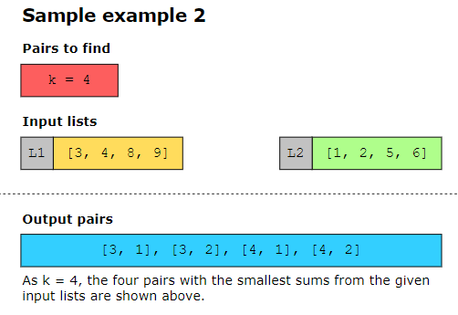

# Merge Sorted Array

# Kth Smallest Number in M Sorted Lists

# Find K Pairs with Smallest Sums

# When we have more than two sorted arrays or linked lists, we use a min-heap. For just two lists or arrays, we can directly compare them.