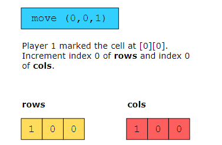
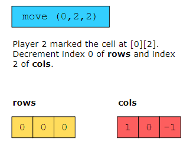
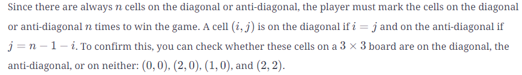
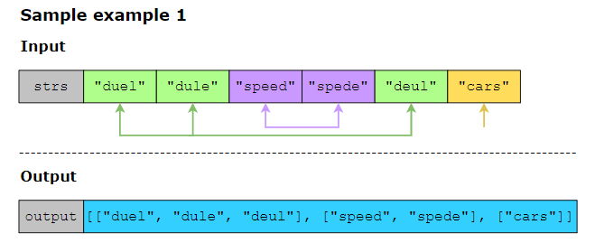

## Palindrome Permutation ###############
For a given string, st, find whether or not a permutation of this string is a palindrome. You should return TRUE if such a permutation is possible and FALSE if it isn’t possible.

## Valid Anagram ###########################

## Design Tic-Tac-Toe ######################
Suppose that two players are playing a tic-tac-toe game on an n×n board. They’re following specific rules to play and win the game: A move is guaranteed to be valid if a mark is placed on an empty block. No more moves are allowed once a winning condition is reached. A player who succeeds in placing n of their marks in a horizontal, vertical, or diagonal row wins the game.
player can win the game if the following conditions are met:

They are able to mark an entire row.
They are able to mark an entire column.
They are able to mark all the cells of one of the two diagonals.

The following are the three kinds of win scenarios in tic-tac-toe:

Player 1 wins
Player 2 wins
No player wins
A player can win by marking all the cells in a row or a column, or along the diagonal, or, along the anti-diagonal. To identify whether either of the two players wins or if it’s a tie between the two players, we can efficiently count the marks made on the tic-tac-toe board.

solution:
Since there are 𝑛 rows and 𝑛 columns on a board, at each move, we need a way to check if the player has already marked all 𝑛 cells in that row or column.
We increment the count when Player 1 marks a cell and decrement the count when Player 2 marks a cell. To implement this, we set the current_player to 1 for Player 1’s move and set it to -1 for Player 2’s move. We add this to the corresponding row and column in the rows and cols array.

diagonal and anti-diagonal

## Group Anagrams ########################
Given a list of words or phrases, group the words that are anagrams of each other. An anagram is a word or phrase formed from another word by rearranging its letters.

solution:
we can consider a key as 26 alphabet indices of English letter([0,0,0,...,0]) so we traverse the input string character by character and we make the corresponding index in the key to 1 then we add the key to a hash map => the string with the same anagram will have the same key => this way, values of hash map will be what we want (key = 26 alphabet_ index and value = traversed_string).

## Maximum Frequency Stack ################
Design a stack-like data structure. You should be able to push elements to this data structure and pop elements with maximum frequency.

You’ll need to implement the FreqStack class that should consist of the following:

Init(): This is a constructor used to declare a frequency stack.

Push(value): This is used to push an integer data onto the top of the stack.

Pop(): This is used to remove and return the most frequent element in the stack.

