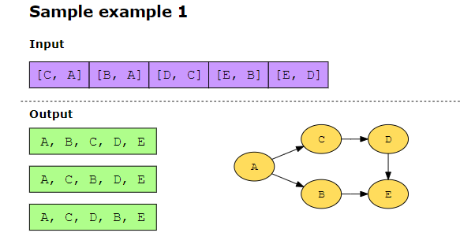
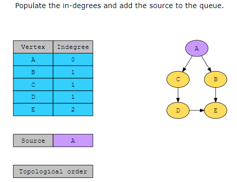
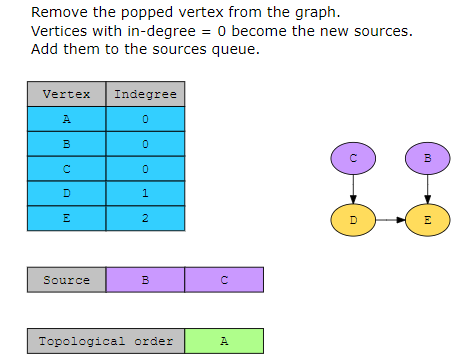
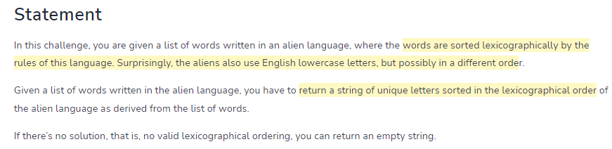
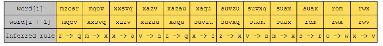
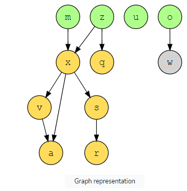
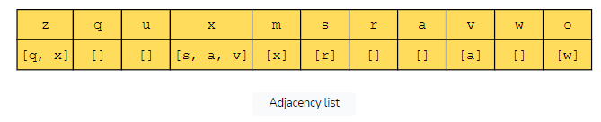
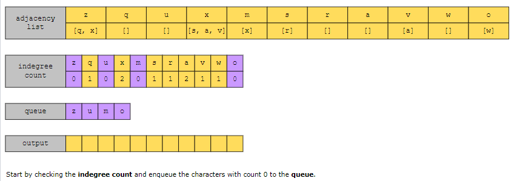
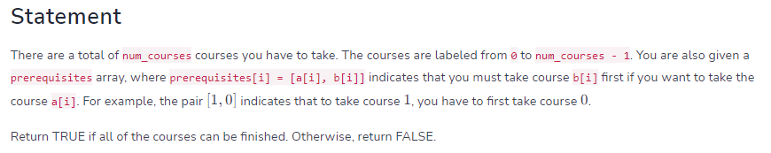
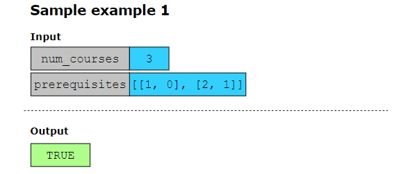

# Compilation order########################

We can say that a topological ordering starts with one of the sources and ends at one of the sinks:

Source: Any vertex with no incoming edge and only outgoing edges is called a source.

Sink: Any vertex that has only incoming edges and no outgoing edge is called a sink.
in-degrees= count of incoming edges of a vertex

# Alien Dictionary ############################

["mzosr", "mqov", "xxsvq", "xazv", "xazau", "xaqu", "suvzu", "suvxq", "suam", "suax", "rom", "rwx", "rwv"]

# Course schedule ######################################

