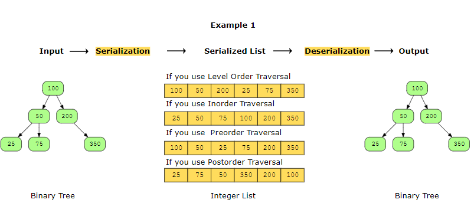
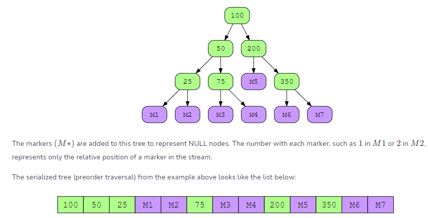
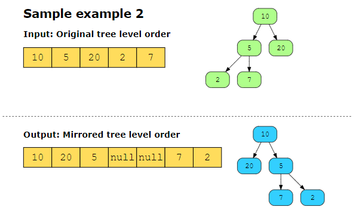
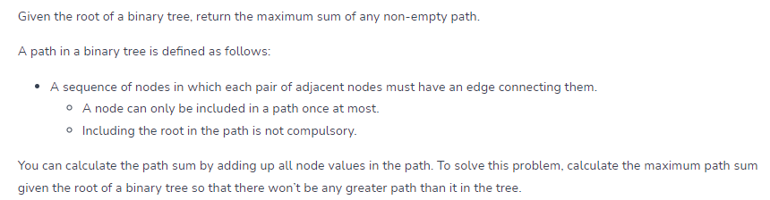
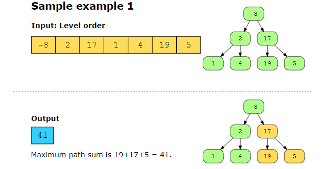
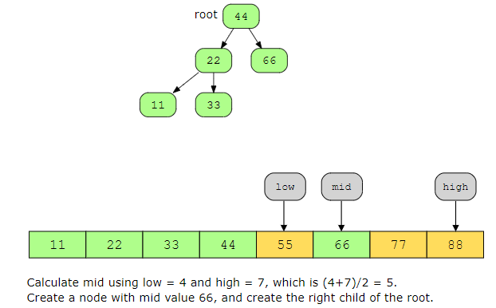
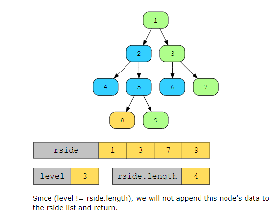
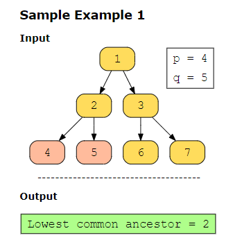

## flatten binart tree to linkedlist #############

## diameter of binary tree #######################
The diameter of a binary tree is the length of the longest path between any two nodes in a tree. This path may or may not pass through the root.

## serialize and Deserialize Binary Tree ###########
Serialize: Write the tree to a file.

Deserialize: Read from a file and reconstruct the tree in memory.

## Invert Binary Tree ############################

solution:
Perform post-order traversal on the left child of the root node.
Perform post-order traversal on the right child of the root node.
Swap the left and right children of the root node.

## Binary Tree Maximum Path Sum #################

## Convert Sorted Array to Binary Search Tree ######
Given an array of integers, nums, sorted in ascending order, your task is to construct a height-balanced binary search tree (BST) from this array.

In a height-balanced BST, the difference of heights of the left subtree and right subtree of any node is not more than 1.

## Build Binary Tree from Preorder and Inorder Traversal #####
Create a binary tree from two integer arrays, p_order and i_order, where p_order represents a preorder traversal of a binary tree, and i_order represents an inorder traversal of the same tree.

Solution#

To construct the binary tree from the given preorder and inorder traversals, we can use the preorder traversal to decide the root node of each subtree and inorder traversal to determine the left and right subtrees of that node.

In a preorder traversal, the root node of a tree is always visited before any of its children. Therefore, the first node in the preorder list is the root node of the entire tree. In an inorder traversal, the order of traversal is left, root, and then right. Therefore, the middle element will be the root, the element before the middle will be the left child, and the element after the middle will be the right child. So, we can use the inorder list to determine the left and right subtrees of this root node. We will search the node value in the inorder list, the elements before this value will create the left subtree of this node, and the elements after this value will create the right subtree of this node. We will recursively perform these steps to build the whole tree.

## Binary Tree Right Side View #######################
You are given a root of a binary tree that has n number of nodes. You have to return the right-side view in the form of a list.

A right-side view of a binary tree is the data of the nodes that are visible when the tree is viewed from the right side.

we use level variable here to ignore the rest of nodes on the left.

## Lowest Common Ancestor in a Binary Tree ######
Given the root node of a binary tree with 𝑛 nodes, your task is to find the lowest common ancestor of two of its nodes, p and q.
The lowest common ancestor of two nodes, p and q, is defined as the lowest node in the binary tree that has both p and q as descendants.

## Validate Binary Search Tree ##########
Given the root of a binary tree, check whether it is a valid binary search tree (BST).

A binary tree is a valid BST if for every node:

The value of the node is greater than or equal to the value of its left node.

The value of the node is less than or equal to the value of its right node.

Both the left and right subtrees are valid BSTs.

## Maximum Depth of Binary Tree ####################
You are given the root of a binary tree, and your task is to determine the maximum depth of this tree. The maximum depth of a binary tree is determined by the count of nodes found on the longest path from the root node to the farthest leaf node.

## Kth Smallest Element in a BST ###################
Given the root node of a binary search tree and an integer value k, return the 𝑘𝑡ℎ smallest value in the tree.

