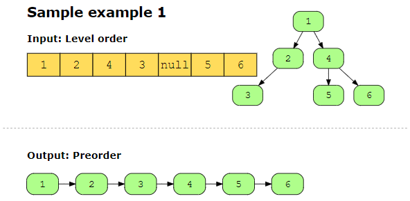
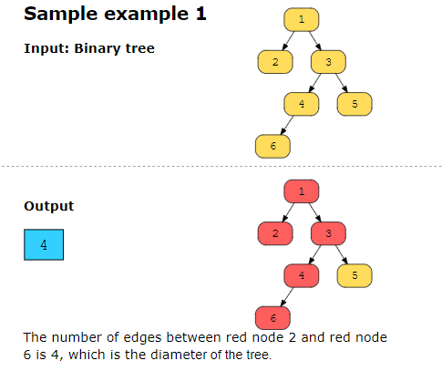

## flatten binart tree to linkedlist #############

## diameter of binary tree #######################
The diameter of a binary tree is the length of the longest path between any two nodes in a tree. This path may or may not pass through the root.

