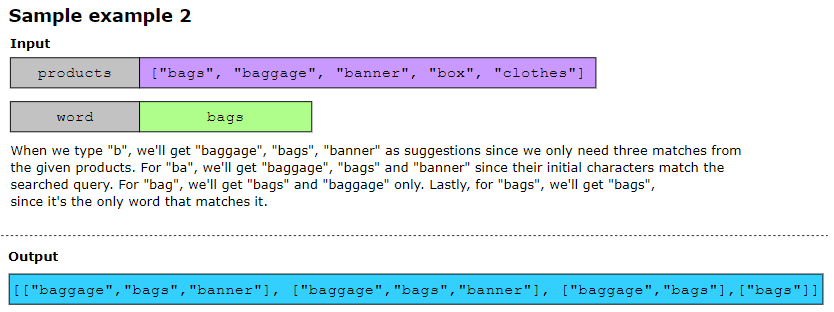
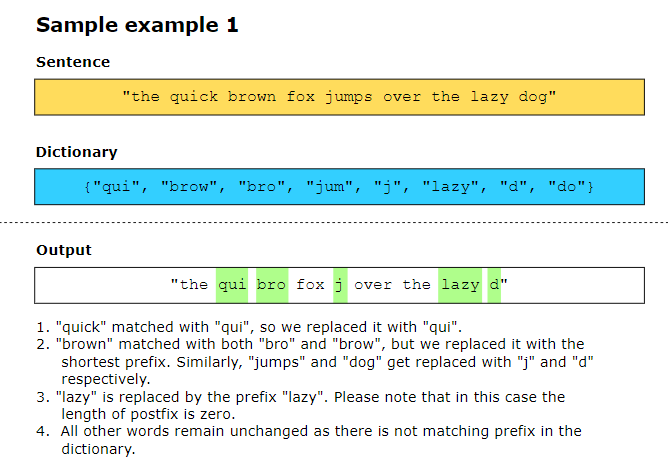
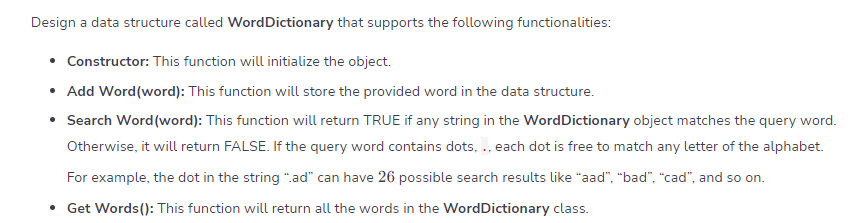

## Implement Trie #################
Trie is a tree-like data structure used to store strings. The tries are also called prefix trees because they provide very efficient prefix-matching operations. Implement a trie data structure with three functions that perform the following tasks:

Insert (word): This inserts a word into the trie.
Search (word): This searches the given word in the trie and returns TRUE, if found. Otherwise, return FALSE.
Search prefix (prefix): This searches the given prefix in the trie and returns TRUE, if found. Otherwise, return FALSE.

## Search Suggestions System #################
Given an array of strings called products and a word to search, design a system that, when each character of the searched word is typed, suggests at most three product names from products. Suggested products should share a common prefix with the searched word. If more than three products exist with a common prefix, return the three product names that appear first in lexicographical order.

Return the suggested products, which will be a list of lists after each character of searched word is typed.

## Replace Words #######################
In this problem, we are considering the words that are composed of a prefix and a postfix. For example, if we append a postfix “happy” to a prefix “un”, it forms the word “unhappy”. Similarly, “disagree” is formed from a prefix, “dis” followed by a postfix, “agree”.

You’re given a dictionary, dictionary, consisting of prefixes, and a sentence, sentence, which has words separated by spaces only. Your task is to replace the postfix in sentence with their prefixes given in dictionary (if found) and return the modified sentence.

## Design Add and Search Words Data Structure #########################

## Word Search II #####################################
You are given a list of strings that you need to find in a 2D grid of letters such that the string can be constructed from letters in sequentially adjacent cells. The cells are considered sequentially adjacent when they are neighbors to each other either horizontally or vertically. The solution should return a list containing the strings from the input list that were found in the grid.

## Lexicographical Numbers ##############################
Given an integer value 𝑛, write a function that returns all the numbers in the range 1 to 𝑛 in lexicographical order.
After exhausting all numbers starting with 1 (up to n), we move to the next smallest number, which is 2.
if there are no numbers starting with 2 beyond 2 itself within the range, it is followed by 3, then 4, and so on up to 9.
for example for n = 13, we should have 13 output, we start for 1 -> 10 -> 11 -> 12 -> 13 -> 2 -> 3 -> 4 -> 5 -> 6 -> 7 -> 8 ->9
for n = 26 => 1, 10, 11, 12, 13, 14, 15, 16, 17, 18, 19, 2, 20, 21, 22, 23, 24, 25, 26, 3, 4, 5, 6, 7, 8, 9