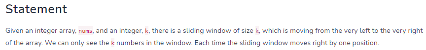
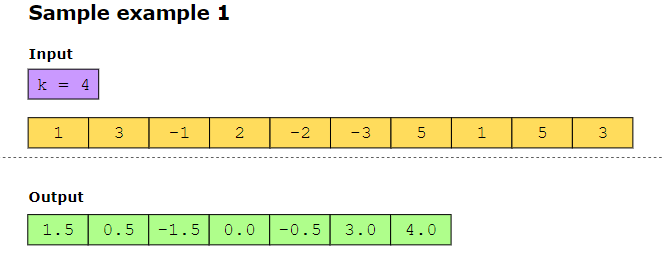
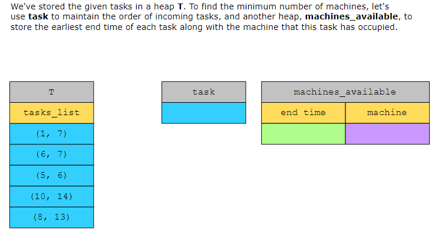
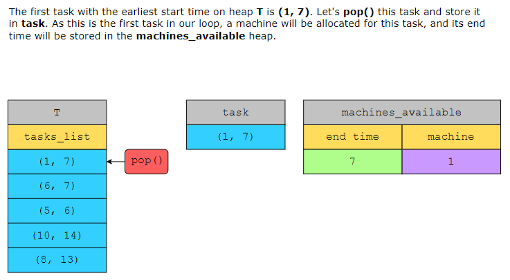
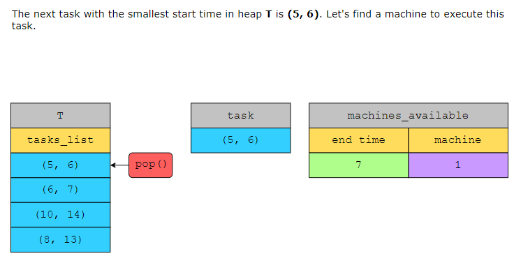
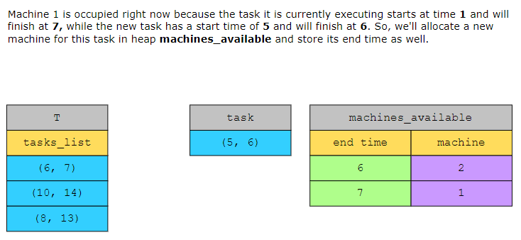

# Sliding Window Median

# Tasks on Minimum Machines

We are given an input array, tasks, which contains the start and end times of n tasks. Your task is to find the minimum number of machines required to complete these 
𝑛 tasks.

