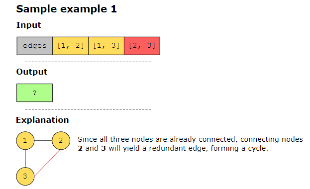
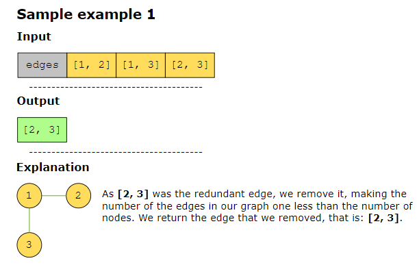
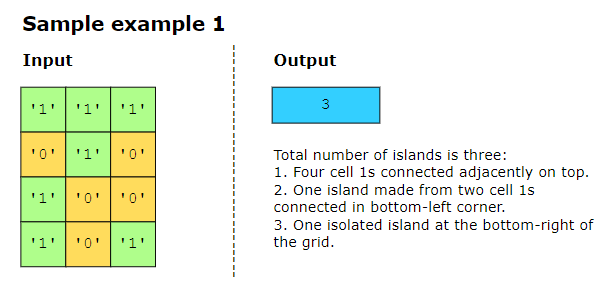
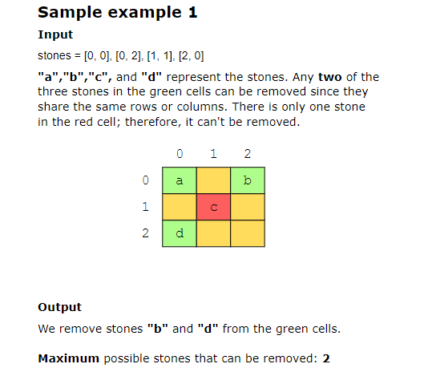

## Redundant Connection ######################
We’re given an undirected graph consisting of 𝑛 nodes. The graph is represented as list called edges, of length 𝑛, where edges[i] = [a, b] indicates that there is an edge between nodes a and b in the graph. Return an edge that can be removed to make the graph a tree of 𝑛 nodes. If there are multiple candidates for removal, return the edge that occurs last in edges.

## Number of Islands ########################
Let’s consider a scenario with an (𝑚×𝑛) 2D grid containing binary numbers, where '0' represents water and '1' represents land. If any '1' cells are connected to each other horizontally or vertically (not diagonally), they form an island. Your task is to return the total number of islands in the grid.

## Most Stones Removed with Same Row or Column ################

