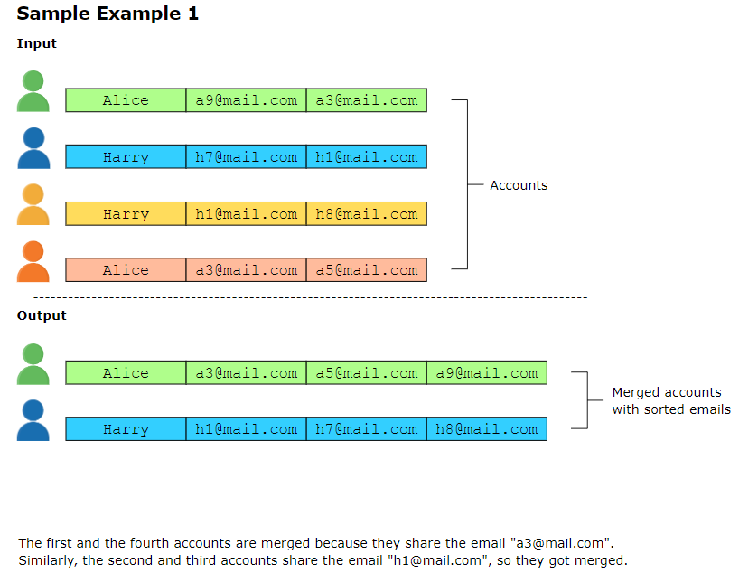
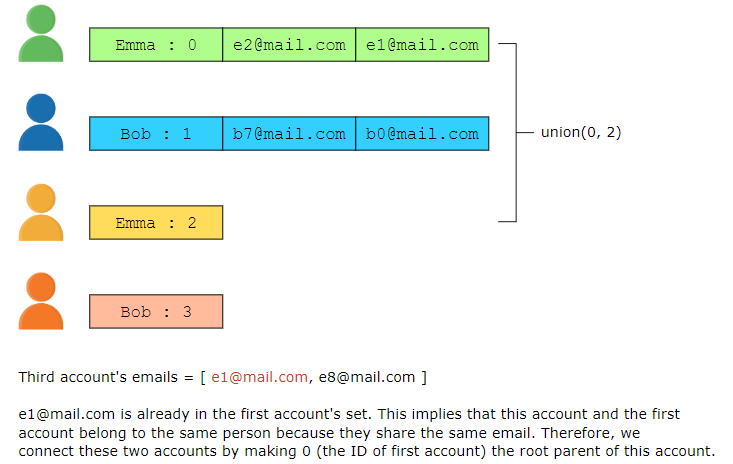
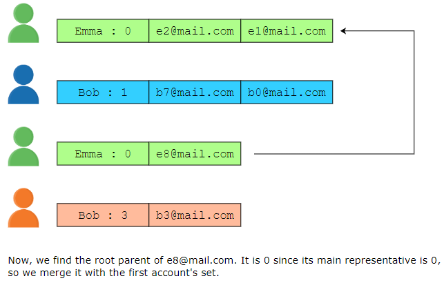
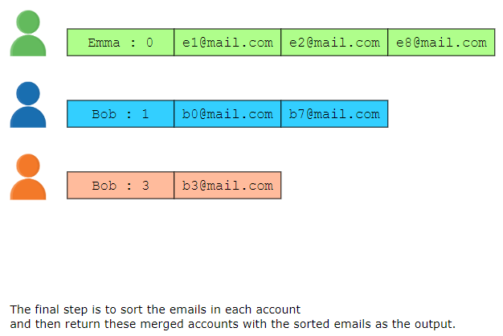
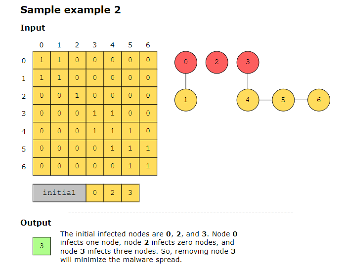
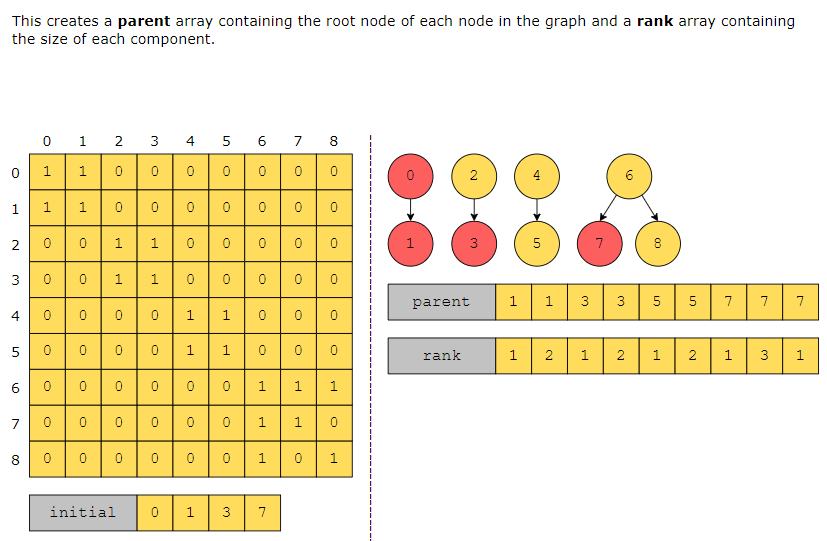
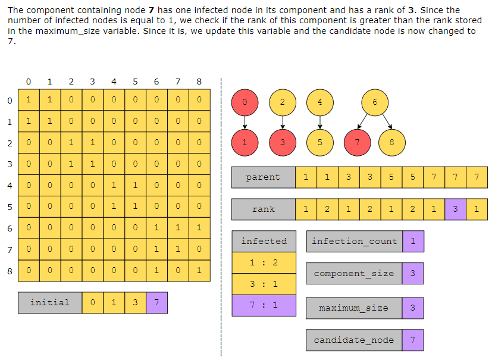

## Accounts Merge #####################
The output should be a 2D array in which the first element of each row is the name, and the rest of the elements are the merged list of that user’s email addresses in sorted order. There should be one row for each distinct user, and for each user, each email address should be listed only once.

solution:
Since the problem involves merging the accounts that have common emails among them, we'll use the union find pattern to solve it. The union find pattern is used to group elements into sets based on a specified property.

## Minimize Malware Spread ################

the row of the matrix is node number and column is node number as well. so we have row 0 node 0 vs col node 0, 1,2,3,4,5.. if the number in cell = 1 means node row is connected to that node col.

solution:

## Evaluate Division ###########

