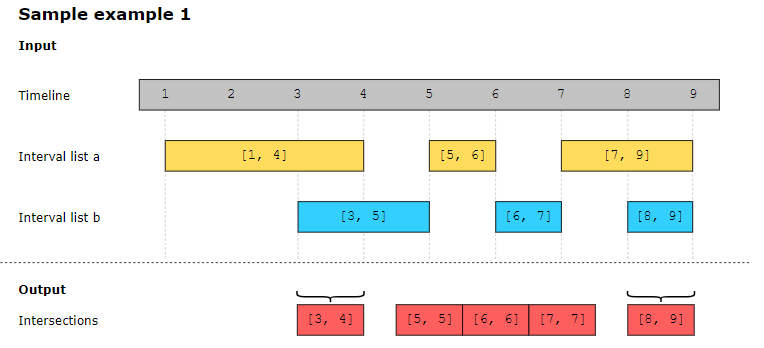

For two lists of closed intervals given as input, interval_list_a and interval_list_b, where each interval has its own start and end time, write a function that returns the intersection of the two interval lists.

