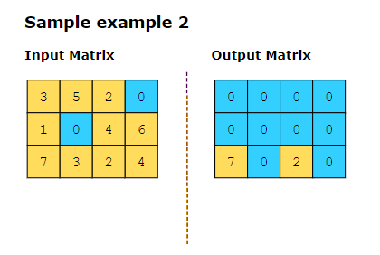
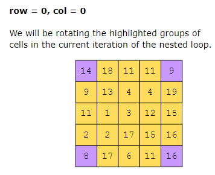
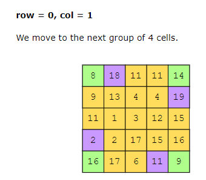

## Set Matrix Zeros##########
Given a matrix, mat, if any element within the matrix is zero, set that row and column to zero.

## Rotate matrix #######################
Given an 𝑛×𝑛 matrix, rotate the matrix 90 degrees clockwise. The performed rotation should be in place, i.e., the given matrix is modified directly without allocating another matrix.

