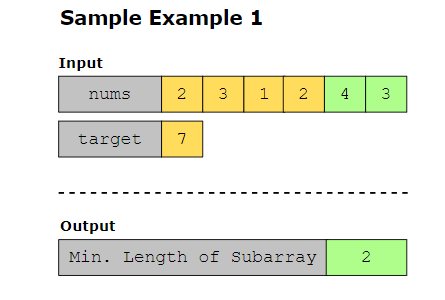

Statement

Given an array of positive integers, nums, and a positive integer, target, find the minimum length of a contiguous subarray whose sum is greater than or equal to the target. If no such subarray is found, return 0.

