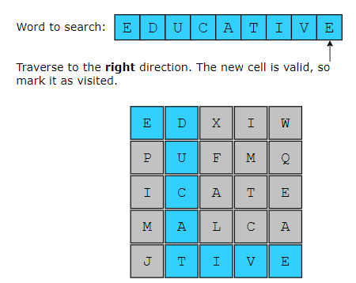
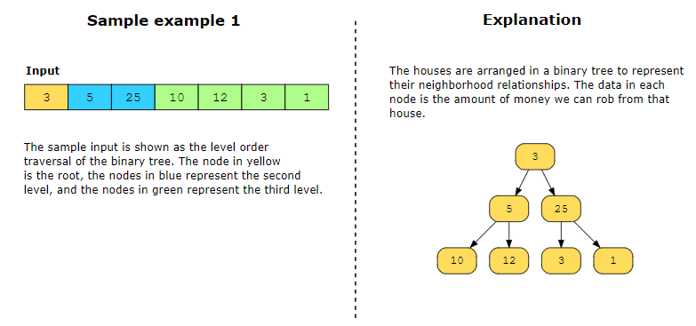
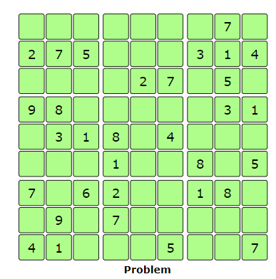
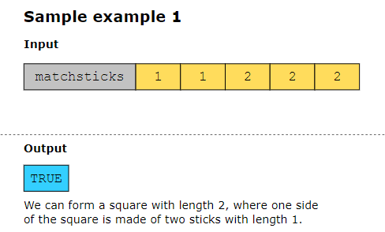

# N-queen problem
Given a chessboard of size n×n, determine how many ways 𝑛 queens can be placed on the board, such that no two queens attack each other.

A queen can move horizontally, vertically, and diagonally on a chessboard. One queen can be attacked by another queen if both share the same row, column, or diagonal.

backtracking algorithm to solve the n−queens problem is very similar to a depth-first search of a tree.

There are two conditions that cause us to backtrack, but for two different purposes:

1- When we find that we cannot place the current queen in a particular row, we have to backtrack and alter the position of the queen whose position was decided before the current one. Next, we move forward again to find a safe position for the current queen.

2- Once we find a valid solution, we still have to identify all the other valid solutions. So, we backtrack by removing the last queen placed on the board and resuming our search for solutions from that point. In order to be sure to find all possible solutions, we’ll need to backtrack, row by row, all the way back to the first queen placed on the board, changing its position and then looking for alternative solutions.

# Word Search

#  House Robber 3
A thief has discovered a new neighborhood to target, where the houses can be represented as nodes in a binary tree. The money in the house is the data of the respective node. The thief can enter the neighborhood from a house represented as root of the binary tree. Each house has only one parent house. The thief knows that if he robs two houses that are directly connected, the police will be notified. The thief wants to know the maximum amount of money he can steal from the houses without getting caught by the police. The thief needs your help determining the maximum amount of money he can rob without alerting the police.

# Restore IP Addresses
Given that a string, s, contains digits, return a list of all possible valid IP addresses that can be obtained from the string.

# Flood Fill
Suppose that a (4×4) grid has a source value of 1 at coordinates [1,1]. We perform flood fill on its neighboring cells only if they have the same source value as this cell. Once all adjacent cells are updated, return the new grid after performing flood fill. If no neighboring cell has a value equal to the source cell, only update the source cell with the target value and return the updated grid.

# Sudoku Solver
Given a 9 x 9 sudoku board, solve the puzzle by completing the empty cells. The sudoku board is only considered valid if the rules below are satisfied:

Each row must contain digits between 1–9, and there should be no repetition of digits within a row.

Each column must contain digits between 1–9, and there should be no repetition of digits within a column.

The board consists of 9 non-overlapping sub-boxes, each containing 3 rows and 3 columns. Each of these 3 x 3 sub-boxes must contain digits between 1–9, and there should be no repetition of digits within a sub-box.

# Matchsticks to Square
Given an integer array, matchsticks, where matchsticks[i] is the length of the ith matchstick. Use every single matchstick to create a square. No stick should be broken, although they can be connected, and each matchstick can only be used once.

