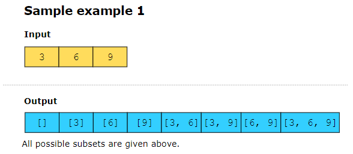
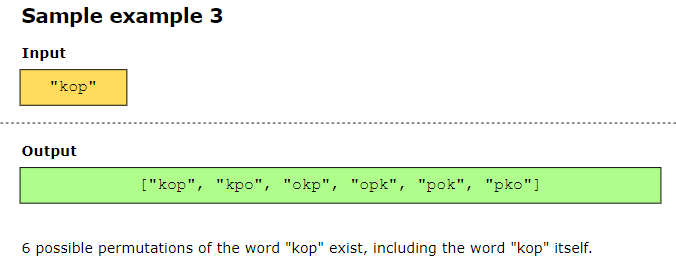
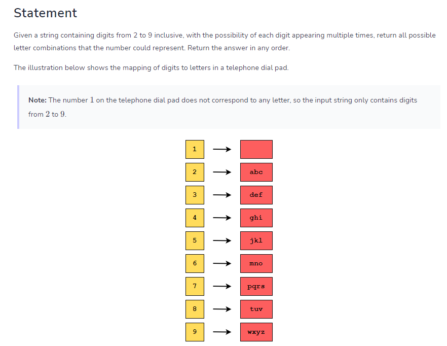
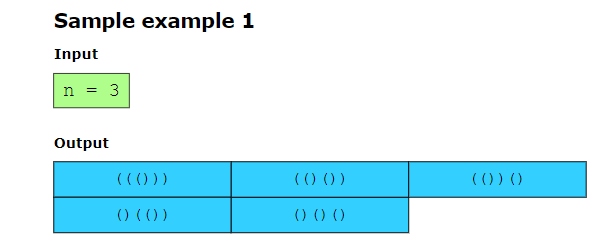

# Subsets #######################################
Given an array of integers, nums, find all possible subsets of nums, including the empty set.
we can generate each subset using a binary representation of the indices. We will initiate a loop from i = 0 to i = subsets_count - 1. subsets_count = 2^len(array)
because total number of subset for an array = 2^len(array).
get_bit(i,j)==1 to know if jth bit of i is set 1. in general we have i = 0 to subsets_count - 1, we wanna know for each i, which element of array we should pick and we decide that with get_bit(i,j). for example we have array [1, 2, 3], for i = 3, binary 011 => set bits in i correspond to the first and second elements from the original set, resulting in the subset [1, 2]. 

# Permutations #################################
Given an input string, word, return all possible permutations of the string. permutation is similar to subset but array here is string.
Input string = “xyz”, output_string = [“xyz”, “xzy”, “yxz”, “yzx”, “zyx”, “zxy”]
We know that n! is the number of permutations for a set of size 𝑛.
solution:
we keep one index fix and swap the other letter each time, for example we start with index =0 and swap index 1 and 2 => "xzy" or we swap index 0 and index 1 => "yxz" then index 2,3 => "yzx" ... we use backtracking for this problem.

# letter combinations of a phone number #########################
we have an digit input string from 2 to 9 example "23", and each digit is mapped to multiple letter for ecample 2 -> "abc"  return all possible letter combinations that the input string could represent. for "23" => ["ad","ae","af","bd","be","bf","cd","ce","cf"]

# Generate parentheses ####################################
For a given number, n, generate all combinations of balanced parentheses. n = 3, output = ["((()))","(()())","()(())","()()()"]

## Find K-Sum Subsets ############
we have an input array of integers, find all the possible subsets of integers that sum up to a number k.
array = [1,3,5,21,19,7,2] , k = 10 => output = {3,7},{3,5,2},{1,7,2}

