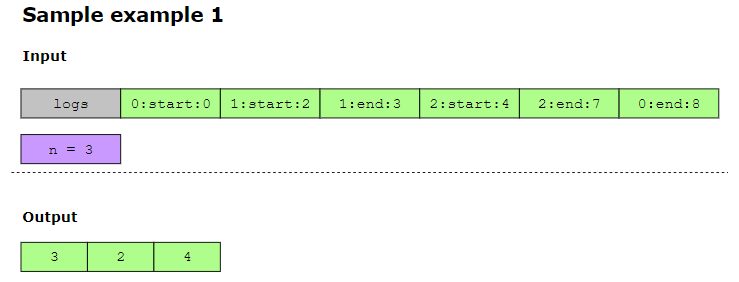

## Basic Calculator ##################
Given a string containing an arithmetic expression, implement a basic calculator that evaluates the expression string. The expression string can contain integer numeric values and should be able to handle the “+” and “-” operators, as well as “()” parentheses. exp = "(8 + 100) + (13 - 8 - (2 + 1))"

## Exclusive Execution Time of Functions ########################

